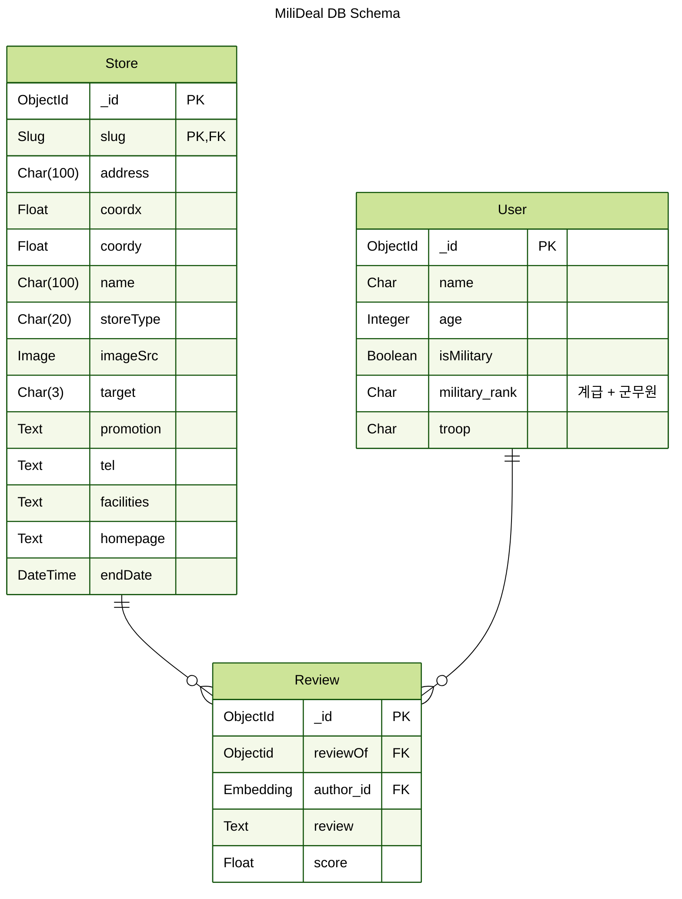

```
┌────────────────────────────────────────┐
 ___  ___ _  _  _ ______               _ 
 |  \/  |(_)| |(_)|  _  \             | |
 | .  . | _ | | _ | | | |  ___   __ _ | |
 | |\/| || || || || | | | / _ \ / _` || |
 | |  | || || || || |/ / |  __/| (_| || |
 \_|  |_/|_||_||_||___/   \___| \__,_||_|
	             🤑 𝙔𝙤𝙪 𝙘𝙖𝙣 𝙜𝙚𝙩 𝙖 𝙙𝙞𝙨𝙘𝙤𝙪𝙣𝙩!
└────────────────────────────────────────┘
```

# 군 장병 AI · SW 역량강화 by 카오엔터프라이즈 3팀 - MiliDeal
API 개발 담당 저장소입니다.

